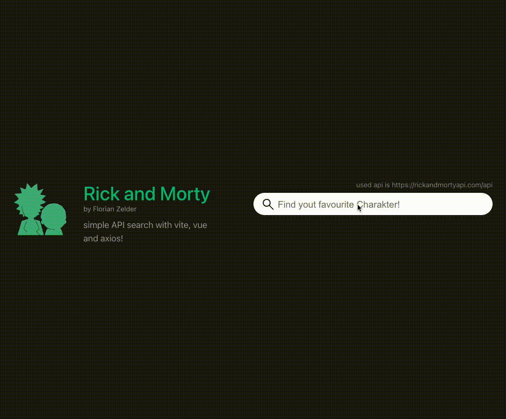

# RickAndMortyVue

This Rick and Morty Application is based on vite, vue and axios.

## Project Setup

```sh
npm install
```

### Compile and Hot-Reload for Development

```sh
npm run dev
```

### Compile and Minify for Production

```sh
npm run build
```

### Queryparameter for API-Change (local/remote/azure)
```sh
?api=azure 

local: apiUrlLocal
azure: apiUrlAzure
remote: apiUrlRemote
```


### Preview
 
 
****
